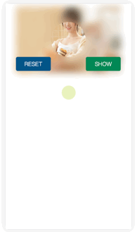

# Canvas 制作红包封面效果

#### 教程地址

https://www.imooc.com/learn/601

#### 需求背景

1. 初始图片为模糊显示效果；

2. 鼠标点击时点击区域出现一个圆形区域的清晰图片，移动鼠标显示对应地方的清晰图片；

3. 点击“SHOW”按钮，显示完整清晰图片(带动画效果)；

4. 点击“RESET”按钮，显示初始模糊图片；

#### 解决思路

1. 默认放一张图片，使用CSS3的filter属性制作模糊滤镜效果(filter属性参考：)；

2. 叠放一张canvas画布，与图片大小相等；

3. canvas绘制一个圆形剪辑区域和drawImage将原图绘制进canvas里，用剪辑区域去剪辑canvas里的图形，这样页面可视区域就只能看见剪辑区域内的图像；

4. 典型的鼠标与canvas交互、移动端事件处理；

5. 粗糙的屏幕兼容处理；

#### 效果图

- ##### PC端

  

- ##### 移动端

  

